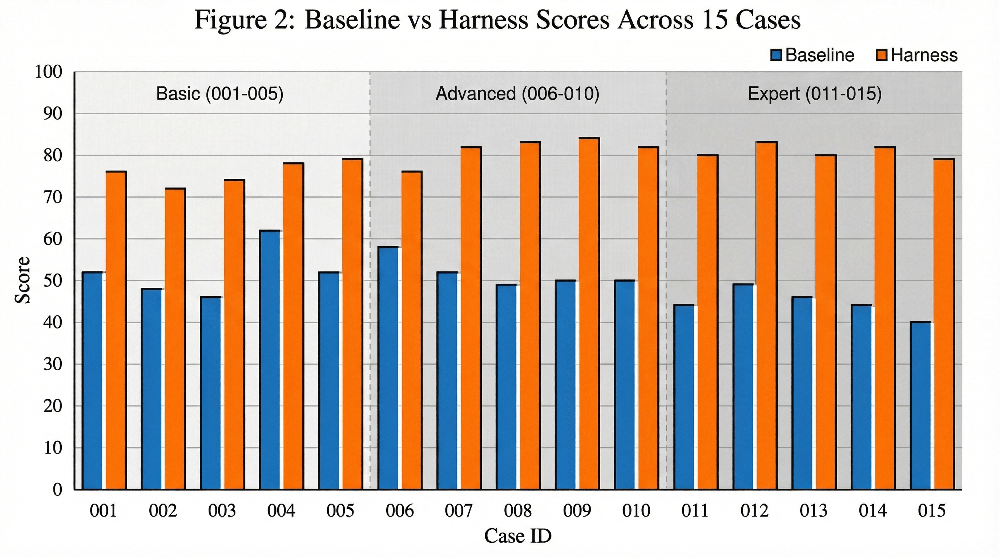
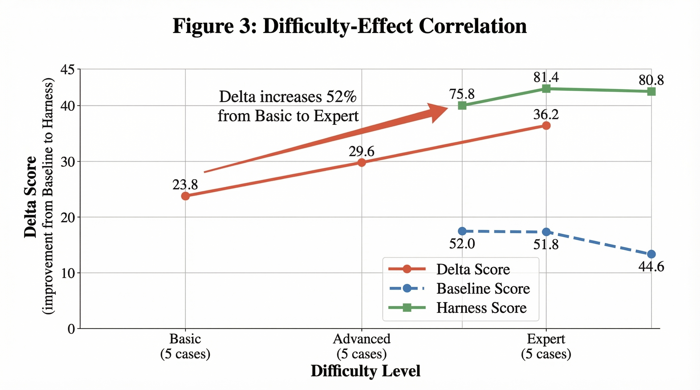
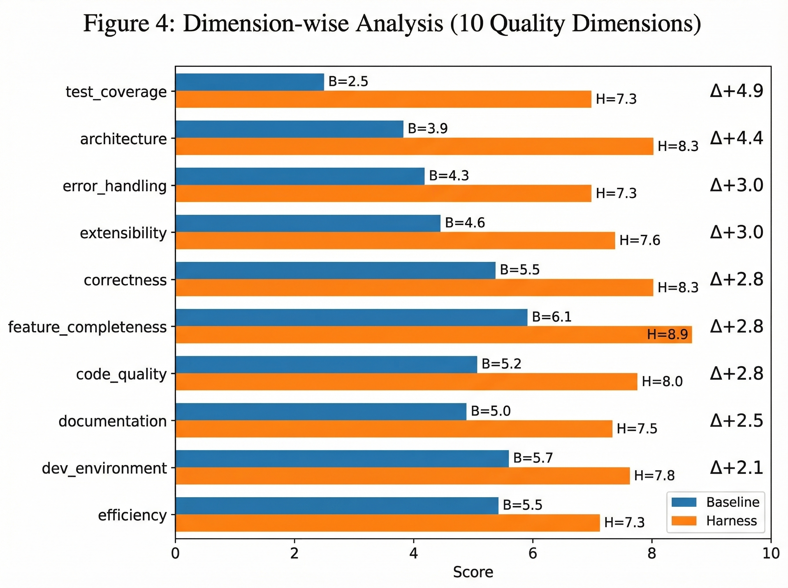

# Harness: Structured Pre-Configuration for LLM Code Agents

**Harness** is a framework that dramatically improves LLM code agent output quality through structured pre-configuration. By providing architectural blueprints, domain-specific knowledge references, role-based agent definitions, and workflow orchestration before task execution, Harness bridges the gap between an LLM's broad knowledge and the project-specific guidance needed for production-quality output.

> **Key Result:** In a controlled A/B experiment across 15 software engineering tasks, Harness improved average quality from **49.5 to 79.3 points** (out of 100) — a **60% improvement**. The effect scales with complexity: Basic +23.8, Advanced +29.6, Expert **+36.2**.

<p align="center">
  
</p>

## Why Harness?

LLM code agents like Claude Code can generate functional software from natural language. But their output often lacks:

- **Architecture** — monolithic single-file implementations instead of modular designs
- **Test coverage** — tests are rarely generated without explicit guidance
- **Error handling** — happy-path focus with minimal edge case coverage

Harness solves this by providing the same kind of structural context that experienced engineers bring to their projects — before the agent writes a single line of code.

## How It Works

Harness resides in the `.claude/` directory and provides four types of guidance:

```
.claude/
  CLAUDE.md           # Architectural blueprint — file structure, patterns, rules
  skills/             # Domain-specific knowledge — algorithm specs, references
    skill-name/
      SKILL.md        # Skill definition with YAML frontmatter
      references/     # Detailed implementation references
  agents/             # Role decomposition — specialized sub-agent definitions
  commands/           # Workflow orchestration — slash-invokable workflows
```

| Component | Purpose | Example |
|-----------|---------|---------|
| **CLAUDE.md** | Defines target architecture, file organization, naming conventions | 5-layer LSP server architecture diagram |
| **Skills** | Algorithm-specific patterns, data structures, correctness criteria | Raft RPC specifications, Pratt parser algorithms |
| **Agents** | Role-based task decomposition with quality contracts | Parser builder, Transport builder, Test agent |
| **Commands** | Multi-step workflows coordinating skills and agents | `/experiment`, `/evaluate`, `/report` |

## Experiment

We conducted a controlled A/B experiment comparing **Baseline** (Claude Code with prompt only) vs **Harness** (Claude Code with `.claude/` pre-configuration) across 15 tasks at three difficulty levels.

### Task Overview

| Difficulty | Cases | Examples |
|-----------|-------|---------|
| **Basic** (001-005) | 5 | REST API, Bug Fix, Refactoring, README, CLI Tool |
| **Advanced** (006-010) | 5 | Interpreter, Microservice, SQL Engine, CRDT Editor |
| **Expert** (011-015) | 5 | Raft Consensus, Bytecode VM, Event Sourcing, LSP Server |

### Results

| Metric | Baseline | Harness | Delta |
|--------|----------|---------|-------|
| Average Score | 49.5 | 79.3 | **+29.9 (+60%)** |
| Win Rate | — | — | **15/15 (100%)** |
| Std Dev | 5.3 | 3.6 | -32% variance |

### The Difficulty-Effect Correlation

The most significant finding: **Harness effectiveness scales with task complexity.**

<p align="center">
  
</p>

| Difficulty | Baseline | Harness | Delta |
|-----------|----------|---------|-------|
| Basic | 52.0 | 75.8 | +23.8 |
| Advanced | 51.8 | 81.4 | +29.6 |
| Expert | 44.6 | 80.8 | **+36.2** |

Delta increases **52%** from Basic to Expert — Harness delivers the most value where it's most needed.

### Dimension Analysis

Evaluation covers 10 quality dimensions (each 0-10, total 100):

<p align="center">
  
</p>

Top improvements:
1. **Test Coverage** — +4.9 (Baseline avg 2.5 = almost no tests)
2. **Architecture** — +4.4 (Baseline avg 3.9 = monolithic tendency)
3. **Error Handling** — +3.0
4. **Extensibility** — +3.0

## Project Structure

```
claude-code-harness/
  .claude/                    # Project-level Harness configuration
    skills/                   # Experiment-related skills
    commands/                 # Slash commands (/experiment, /evaluate, /report)
  experiments/
    cases/                    # 15 task definitions (YAML)
    results/                  # Per-case results
      case-{001-015}/
        baseline/             # Baseline output (no .claude/)
        harness/              # Harness output (with .claude/)
          .claude/            # Case-specific Harness configuration
            CLAUDE.md
            skills/
            agents/
        evaluation.json       # 10-dimension comparative evaluation
    reports/                  # Aggregate reports and data
  paper/                      # Academic paper
    harness-paper.html        # English (two-column, self-contained)
    harness-paper.pdf         # English PDF (9 pages)
    harness-paper-ko.html     # Korean translation
    harness-paper-ko.pdf      # Korean PDF (9 pages)
    figures/                  # matplotlib-generated figures (6)
```

## Paper

The full academic paper is available in two languages:

- **English**: [`paper/harness-paper.pdf`](paper/harness-paper.pdf)
- **Korean**: [`paper/harness-paper-ko.pdf`](paper/harness-paper-ko.pdf)

**Citation:**
```
Hwang, M. (2026). Harness: Structured Pre-Configuration for Enhancing
LLM Code Agent Output Quality. A Controlled Experiment with 15 Software
Engineering Tasks.
```

## Quick Start

### Creating a Harness for Your Project

1. Create a `.claude/` directory in your project root
2. Write `CLAUDE.md` with your target architecture:

```markdown
# My Project

## Architecture
```
[Client] → [API Layer] → [Service Layer] → [Data Layer]
```

## File Structure
src/
  api/        - Express route handlers
  services/   - Business logic
  models/     - Data models
  utils/      - Shared utilities
tests/        - Mirror src/ structure
```

3. Add Skills for domain-specific knowledge (optional):

```markdown
# .claude/skills/my-domain/SKILL.md
---
name: my-domain-patterns
description: "Domain-specific implementation patterns"
---
# Key patterns and references for this domain
```

4. Define Agents for complex task decomposition (optional):

```markdown
# .claude/agents/api-builder.md
# API Builder Agent
## Role: Implement REST API endpoints
## Deliverables: Route handlers, validation, error responses
## Quality Criteria: OpenAPI compliance, input validation, error codes
```

### Running the Experiment

```bash
# Use the built-in commands
/experiment all          # Run all 15 cases
/evaluate case-011       # Evaluate a specific case
/report full             # Generate comprehensive report
```

## Key Findings

1. **The bottleneck is structure, not capability.** LLMs have sufficient knowledge — they lack project-specific structural guidance.
2. **Test coverage benefits most** (+4.9). Unguided agents almost never write tests.
3. **Architecture is second** (+4.4). Without guidance, agents default to monolithic single-file implementations.
4. **Complexity amplifies the effect.** Simple tasks see moderate gains; complex systems see dramatic improvement.
5. **Automated generation is viable.** The Harness meta-skill can auto-generate configurations from natural language descriptions.

## License

This project is provided for research and educational purposes.

---

*Minho Hwang — revfactory@gmail.com*
