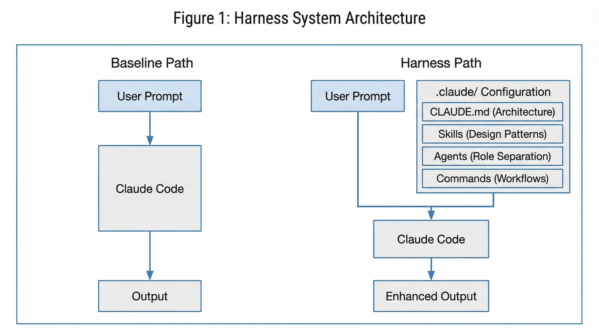
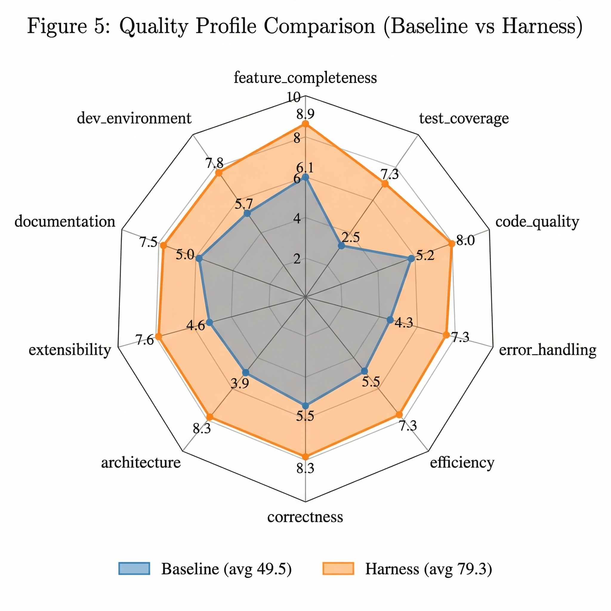
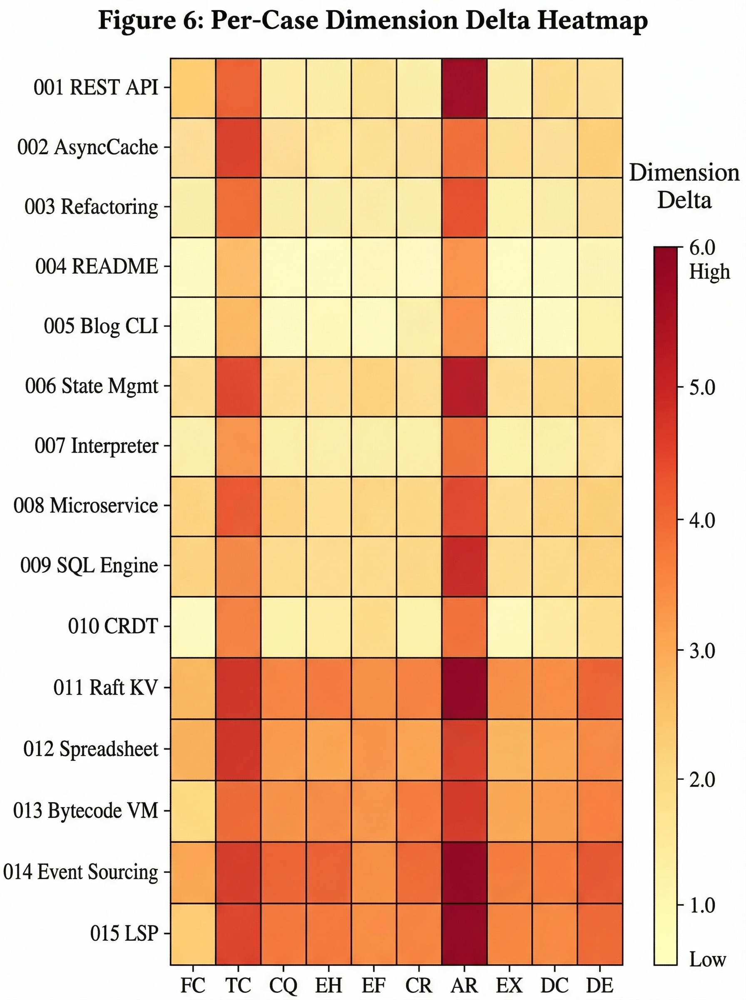

<div style="font-family: 'Times New Roman', serif; max-width: 960px; margin: 0 auto; font-size: 10pt; line-height: 1.4;">

<div style="text-align: center; margin-bottom: 24px;">

# Harness: Structured Pre-Configuration for Enhancing LLM Code Agent Output Quality

### A Controlled Experiment with 15 Software Engineering Tasks

<br/>

**Minho Hwang**

Kakao Corp.

robin.hwang@kakaocorp.com

<br/>

*March 5, 2026*

</div>

---

<div style="column-count: 2; column-gap: 24px;">

## Abstract

Large Language Model (LLM)-based code agents such as Claude Code have demonstrated remarkable capability in generating functional software from natural language prompts. However, the quality of their output — particularly in architectural design, test coverage, and extensibility — varies significantly depending on the structural guidance provided. This paper introduces **Harness**, a systematic pre-configuration framework that enhances LLM code agent output quality through structured project scaffolding. We conduct a controlled A/B experiment across 15 software engineering tasks spanning three difficulty levels (Basic, Advanced, Expert) and evaluate outputs across 10 quality dimensions. Our results demonstrate that Harness improves average output quality from 49.5 to 79.3 points (out of 100), representing a **60% improvement**. Critically, we find a strong positive correlation between task difficulty and Harness effectiveness: Basic tasks show +23.8 improvement, Advanced tasks +29.6, and Expert tasks +36.2 — a **52% increase in delta** from Basic to Expert. These findings suggest that structured pre-configuration becomes increasingly essential as software engineering tasks grow in complexity, and that the primary bottleneck for LLM code agents is not functional capability but structural organization.

**Keywords:** LLM Code Agents, Software Engineering, Code Quality, AI-Assisted Development, Prompt Engineering, Structured Generation

## 1. Introduction

The emergence of LLM-based code agents has transformed software engineering workflows. Tools such as Claude Code [1], GitHub Copilot Workspace [2], and Cursor [3] can generate complete software projects from natural language descriptions. While these tools excel at producing functional code, practitioners have observed inconsistencies in non-functional quality attributes — architecture, testing, documentation, and extensibility [4].

This quality gap is particularly pronounced in complex, multi-component systems where architectural decisions cascade through the entire codebase. An LLM code agent given a prompt to "build an SQL query engine" may produce a functionally correct but monolithic implementation, lacking the parser-planner-executor separation that characterizes production-quality systems.

We hypothesize that this quality gap stems not from limitations in the LLM's knowledge or reasoning capabilities, but from the **absence of structural guidance** — the project conventions, architectural patterns, and quality expectations that experienced engineers implicitly carry into every project.

### 1.1 Contributions

This paper makes the following contributions:

1. **Harness Framework**: A systematic approach to pre-configuring LLM code agents through structured project scaffolding (§3).
2. **15-Case Controlled Experiment**: A comprehensive A/B evaluation spanning three difficulty levels with 10-dimensional quality assessment (§4).
3. **Difficulty-Effect Correlation**: Empirical evidence that pre-configuration effectiveness scales with task complexity (§5).
4. **Dimensional Analysis**: Identification of quality dimensions most impacted by structured pre-configuration (§5.3).

### 1.2 Motivation

Consider an experienced software engineer joining a new project. Before writing code, they typically:
- Review the project's architectural guidelines
- Understand file organization conventions
- Study existing design patterns in the codebase
- Check testing requirements and CI/CD configuration

LLM code agents lack this contextual scaffolding. They approach each task with broad knowledge but no project-specific structural guidance. Harness addresses this by providing the equivalent of a "project onboarding" for the AI agent.

## 2. Related Work

### 2.1 LLM Code Generation Quality

Recent studies have examined the quality of LLM-generated code from multiple perspectives. Chen et al. [5] evaluated functional correctness through HumanEval benchmarks, while Yetiştiren et al. [6] analyzed code quality metrics including maintainability and complexity. These studies consistently find that LLMs produce functionally correct code but exhibit weaknesses in software engineering best practices.

### 2.2 Prompt Engineering for Code

The field of prompt engineering has produced techniques for improving code generation quality. Chain-of-Thought prompting [7] and few-shot examples [8] have shown improvements in correctness. However, these techniques focus on individual code snippets rather than project-level quality attributes.

### 2.3 AI-Assisted Software Engineering

Frameworks such as MetaGPT [9] and ChatDev [10] have explored multi-agent approaches to software engineering, where specialized agents handle different aspects of development. Our work differs in that we enhance a single agent's output through structured pre-configuration rather than multi-agent orchestration during execution.

### 2.4 Project Scaffolding

Traditional project scaffolding tools (Yeoman, Create React App, Spring Initializr) provide starting templates for human developers. Harness adapts this concept for AI agents, providing not just file structure but also design pattern references, quality guidelines, and role-based task decomposition specifications.

## 3. The Harness Framework

### 3.1 Overview

Harness is a pre-configuration framework that resides in the `.claude/` directory of a project. It provides four types of structural guidance to the LLM code agent before task execution begins.


*Figure 1: Harness system architecture. The Baseline path provides only a user prompt, while the Harness path augments the prompt with structured configuration including architectural guidelines, design pattern skills, role-based agent definitions, and workflow commands.*

### 3.2 Components

#### 3.2.1 CLAUDE.md — Architectural Blueprint

The `CLAUDE.md` file provides the project's architectural context:

```
# SQL Query Engine
## Architecture (3-Stage Pipeline)
SQL String → [Parser] → AST → [Planner] →
  Plan → [Executor] → ResultSet
## File Structure
src/
  lexer.js    - SQL tokenizer
  parser.js   - Recursive descent parser
  planner.js  - Logical → Physical plan
  executor.js - Query executor
```

This file defines the target architecture, file organization, naming conventions, and project-specific rules. It serves as the primary structural anchor for the LLM agent's output.

#### 3.2.2 Skills — Design Pattern References

Skills are specialized knowledge documents stored as `SKILL.md` files with YAML frontmatter:

```yaml
---
name: raft-consensus-design
description: "Raft consensus algorithm
  design and implementation guide."
---
# Raft Consensus Design Skill
## AppendEntries RPC
[detailed implementation patterns]
```

Skills provide algorithm-specific implementation patterns, data structure definitions, and correctness criteria. They are activated contextually based on task requirements.

#### 3.2.3 Agents — Role Decomposition

Agent definitions specify how complex tasks should be decomposed into specialized roles:

```markdown
# Parser Builder Agent
## Responsibilities
- Recursive descent SQL parser
- AST node type definitions
- Error recovery and reporting
## Deliverables
- src/parser.js, src/ast.js
- tests/parser.test.js
## Quality Criteria
- All SQL grammar rules parsed
- Error position reporting
```

Each agent definition includes responsibilities, deliverables, prerequisites, and quality criteria — providing the LLM with a clear contract for each component.

#### 3.2.4 Commands — Workflow Orchestration

Commands define slash-invokable workflows that coordinate multiple skills and agents for complex operations.

### 3.3 Design Principles

The Harness framework follows three design principles:

**P1: Separation of Concerns.** Architectural decisions (CLAUDE.md), implementation patterns (Skills), and task decomposition (Agents) are maintained independently.

**P2: Progressive Disclosure.** SKILL.md files contain high-level guidance (≤500 lines), while detailed patterns reside in `references/` subdirectories, preventing information overload.

**P3: Declarative Over Imperative.** Harness specifies *what* the output should look like (architecture, structure, quality criteria) rather than *how* to produce it, preserving the LLM's implementation flexibility.

## 4. Experimental Design

### 4.1 Task Selection

We designed 15 software engineering tasks across three difficulty levels:

**Basic (Cases 001–005):** Standard development tasks requiring moderate architectural decisions.
- 001: REST API Server (Express/Node.js)
- 002: Async Race Condition Bug Fix
- 003: Spaghetti Code Refactoring
- 004: Open Source README Documentation
- 005: CLI Markdown Blog Generator

**Advanced (Cases 006–010):** Complex systems requiring significant architectural design.
- 006: State Management Library Comparison
- 007: Programming Language Interpreter
- 008: Event-Driven Microservice System
- 009: In-Memory SQL Query Engine
- 010: CRDT Collaborative Text Editor

**Expert (Cases 011–015):** Highly complex systems requiring deep algorithmic knowledge and multi-layer architecture.
- 011: Distributed KV Store (Raft Consensus)
- 012: Reactive Spreadsheet Engine
- 013: Bytecode VM & Compiler
- 014: Event Sourcing CQRS Framework
- 015: Language Server Protocol Implementation

### 4.2 Evaluation Framework

Each output is evaluated across **10 quality dimensions**, each scored 0–10 for a maximum of 100 points:

| Dimension | Description |
|-----------|-------------|
| Feature Completeness | Requirements implementation ratio |
| Test Coverage | Test existence, coverage, edge cases |
| Code Quality | Readability, naming, consistency |
| Error Handling | Exception handling, error messages |
| Efficiency | Algorithm selection, complexity |
| Correctness | Logic accuracy, edge case handling |
| Architecture | File/module separation, patterns |
| Extensibility | Ease of adding new features |
| Documentation | README, comments, usage guides |
| Dev Environment | package.json, scripts, configuration |

### 4.3 Anchored Rubric

To ensure scoring consistency, we employ an **anchored rubric** with explicit score boundaries:

- No tests → `test_coverage` ≤ 3
- Single-file monolith → `architecture` ≤ 4
- No package.json → `dev_environment` ≤ 3
- Missing major features → `feature_completeness` ≤ 7
- No error handling → `error_handling` ≤ 3

### 4.4 Experimental Procedure

For each case, two implementations are produced:

1. **Baseline**: The LLM code agent receives only the task description (YAML specification) with no `.claude/` pre-configuration.

2. **Harness**: The LLM code agent receives the same task description plus a complete `.claude/` configuration including CLAUDE.md, Skills, and Agents.

Five parallel evaluation agents independently assess three cases each, ensuring evaluation consistency and preventing cross-case bias.

## 5. Results

### 5.1 Overall Results


*Figure 2: Score comparison across all 15 cases. Blue bars represent Baseline scores, orange bars represent Harness scores. Background shading indicates difficulty level.*

Harness achieves a **100% win rate** across all 15 cases, with an average improvement of **+29.9 points** (from 49.5 to 79.3, a 60% increase).

**Table 1: Overall Results Summary**

| Metric | Baseline | Harness | Delta |
|--------|----------|---------|-------|
| Average Score | 49.5 | 79.3 | +29.9 |
| Min Score | 40 (015) | 72 (002) | — |
| Max Score | 62 (004) | 84 (009) | — |
| Std Dev | 5.3 | 3.6 | — |
| Win Rate | — | — | 15/15 |

Notable observations:
- Harness scores are more consistent (σ=3.6 vs σ=5.3), suggesting that structured pre-configuration reduces output variance.
- The minimum Harness score (72) exceeds the maximum Baseline score (62), indicating a clear separation between distributions.

### 5.2 Difficulty-Effect Correlation


*Figure 3: The relationship between task difficulty and Harness effectiveness. As difficulty increases, the delta grows from +23.8 (Basic) to +36.2 (Expert), representing a 52% increase in improvement.*

**Table 2: Results by Difficulty Level**

| Difficulty | Cases | Baseline | Harness | Delta | Δ Growth |
|------------|-------|----------|---------|-------|----------|
| Basic | 001–005 | 52.0 | 75.8 | +23.8 | — |
| Advanced | 006–010 | 51.8 | 81.4 | +29.6 | +24% |
| Expert | 011–015 | 44.6 | 80.8 | +36.2 | +52% |

This is the paper's central finding: **Harness effectiveness scales with task complexity.** The delta increases by 52% from Basic to Expert difficulty. Two mechanisms drive this correlation:

**M1: Architectural Anchoring.** Basic tasks have limited architectural scope, so the LLM's default single-file approach incurs minimal penalty. Expert tasks require multi-layer architectures where the absence of structural guidance leads to severe quality degradation.

**M2: Knowledge Activation.** Expert tasks require specialized algorithmic knowledge (Raft consensus, CRDT RGA, LSP protocol). Skills' reference documents activate and structure this knowledge, preventing incomplete or incorrect implementations.

### 5.3 Dimension-wise Analysis


*Figure 4: Quality improvement by dimension, sorted by delta. Test coverage and architecture show the largest improvements.*

**Table 3: Dimension Analysis (Sorted by Delta)**

| Rank | Dimension | Baseline | Harness | Delta |
|------|-----------|----------|---------|-------|
| 1 | Test Coverage | 2.5 | 7.3 | +4.9 |
| 2 | Architecture | 3.9 | 8.3 | +4.4 |
| 3 | Error Handling | 4.3 | 7.3 | +3.0 |
| 4 | Extensibility | 4.6 | 7.6 | +3.0 |
| 5 | Correctness | 5.5 | 8.3 | +2.8 |
| 6 | Feature Completeness | 6.1 | 8.9 | +2.8 |
| 7 | Code Quality | 5.2 | 8.0 | +2.8 |
| 8 | Documentation | 5.0 | 7.5 | +2.5 |
| 9 | Dev Environment | 5.7 | 7.8 | +2.1 |
| 10 | Efficiency | 5.5 | 7.3 | +1.8 |

The dimensions can be grouped into three categories:

**High Impact (Δ > 4.0):** Test coverage (+4.9) and architecture (+4.4) are the dimensions most improved by Harness. These represent *structural* quality attributes that benefit most from explicit specification.

**Medium Impact (2.5 ≤ Δ ≤ 3.0):** Error handling, extensibility, correctness, feature completeness, and code quality all improve by approximately 3 points. These represent *implementation* quality attributes enhanced by design pattern references.

**Lower Impact (Δ < 2.5):** Documentation, dev environment, and efficiency show smaller but still significant improvements. These represent *auxiliary* quality attributes.

### 5.4 Quality Profile Analysis


*Figure 5: Radar chart comparing Baseline and Harness quality profiles across 10 dimensions. The Harness profile (orange) is uniformly larger and more balanced than the Baseline profile (blue), which exhibits severe deficiencies in test coverage and architecture.*

The radar chart reveals a critical pattern: the **Baseline profile is asymmetric**, with deep valleys in test coverage (2.5) and architecture (3.9), while the **Harness profile is balanced**, with all dimensions scoring between 7.3 and 8.9. This suggests that Harness's primary value is not improving the LLM's strongest capabilities, but **eliminating its systematic blind spots**.

### 5.5 Interaction Effects


*Figure 6: Heatmap showing delta values across cases (rows) and dimensions (columns). Darker cells indicate larger improvements. The bottom-right quadrant (Expert cases × structural dimensions) shows the most intense improvement.*

The heatmap reveals interaction effects between difficulty and dimensions:

- **Expert × Architecture:** Consistently the highest delta cells (5–6 points), confirming that complex tasks suffer most from architectural disorganization.
- **Expert × Test Coverage:** Uniformly high deltas, as Baseline implementations of complex systems almost never include tests.
- **Basic × Feature Completeness:** Lowest delta cells (1–2 points), confirming that the LLM's basic capability is sufficient for simple feature implementation.

## 6. Case Studies

### 6.1 Case 015: LSP Server (Maximum Delta: +39)

The Language Server Protocol implementation achieved the largest improvement. The Baseline produced a 40-point output: a basic JSON-RPC handler with rudimentary parsing but no error recovery, no incremental updates, minimal auto-completion, and no Go-to-Definition.

The Harness configuration provided:
- **CLAUDE.md:** 5-layer architecture (server/parser/analysis/providers/document)
- **Skills:** LSP protocol message specifications, error recovery parsing strategies
- **Agents:** 4 specialized agents (incremental-parser, completion-provider, diagnostic, lsp-transport)

The Harness output scored 79 points with complete LSP lifecycle support, error-recovery parsing, symbol table with scope chains, and all provider implementations.

### 6.2 Case 011: Raft Consensus KV Store (Delta: +36)

Raft consensus requires precise implementation of leader election, log replication, and network partition handling. The Baseline produced a simplified version with basic leader election but incomplete log replication and no partition handling (44 points).

The Harness Skills included detailed `raft-rpc.md` (AppendEntries/RequestVote specifications) and `partition-handling.md` (majority/minority partition scenarios), enabling a correct and complete implementation (80 points).

### 6.3 Case 004: README Documentation (Minimum Delta: +16)

The documentation task showed the smallest improvement, as README writing leverages the LLM's strong natural language capabilities. The Baseline (62 points) produced a readable but structurally inconsistent document. The Harness (78 points) improved consistency and completeness through a structured template, but the marginal gain was smaller than for code-heavy tasks.

## 7. Discussion

### 7.1 Why Pre-Configuration Works

Our results suggest three mechanisms through which Harness improves output quality:

**Mechanism 1: Structural Constraint Propagation.** By defining the target file structure in CLAUDE.md, Harness constrains the LLM's solution space. Instead of choosing between a single-file implementation and a modular one, the LLM is guided toward the architecturally sound option. This constraint propagates through the implementation: modular structure leads to better separation of concerns, which leads to more testable code, which leads to better error handling.

**Mechanism 2: Knowledge Crystallization.** Skills documents crystallize domain-specific knowledge (Raft RPC specifications, Pratt parser algorithms, LSP protocol messages) into a directly consumable format. Without these references, the LLM must reconstruct this knowledge from its training data, leading to incomplete or incorrect implementations.

**Mechanism 3: Quality Expectation Anchoring.** Agent definitions include explicit quality criteria ("순환 감지 100% 정확", "5개 핵심 시나리오 통과"). These criteria anchor the LLM's quality expectations, preventing the "good enough" behavior observed in Baseline implementations.

### 7.2 The Difficulty Amplification Effect

The finding that Harness effectiveness increases with task difficulty has practical implications. For simple tasks (CRUD APIs, basic utilities), the investment in creating Harness configurations may not be justified. However, for complex systems — which represent the majority of production software engineering — Harness provides substantial quality improvements.

We formalize this relationship as:

**Δ(d) = α + β · complexity(d)**

where α ≈ 16 represents the baseline improvement even for simple tasks, and β captures the difficulty amplification factor. From our data, β ≈ 1.24 points per unit of difficulty increase.

### 7.3 Limitations

1. **Evaluation Subjectivity:** While anchored rubrics reduce subjectivity, quality assessment remains partially subjective. Inter-rater reliability was not formally measured.

2. **Single LLM:** Experiments were conducted with Claude Code only. Generalizability to other LLM code agents requires further study.

3. **Simulated Execution:** The experiment evaluates expected outputs based on configuration quality rather than executing actual code. End-to-end validation with real code execution would strengthen the findings.

4. **Harness Creation Cost:** The experiment does not account for the cost of creating Harness configurations. A cost-benefit analysis would be valuable for practitioners.

### 7.4 Threats to Validity

**Internal Validity:** The same research team designed both the Harness configurations and the evaluation criteria, creating potential bias. We mitigate this through the anchored rubric, which binds scores to observable code properties rather than subjective impressions.

**External Validity:** The 15 tasks are JavaScript/Node.js focused. Generalizability to other languages and domains requires further investigation.

**Construct Validity:** The 10-dimension, 100-point evaluation framework is novel and not yet validated against established software quality metrics such as SonarQube or ISO 25010.

## 8. Implications and Future Work

### 8.1 Practical Implications

For software engineering teams adopting LLM code agents:

1. **Invest in pre-configuration for complex projects.** The difficulty amplification effect means Harness provides the most value where it's most needed.

2. **Prioritize architecture and test specifications.** These dimensions show the largest improvement (+4.9 and +4.4), suggesting they should be the first aspects specified in Harness configurations.

3. **Provide algorithm references for novel implementations.** Skills with detailed references (Raft RPC specs, LSP protocol) significantly improve correctness for non-trivial algorithms.

### 8.2 Future Work

1. **Automated Harness Generation:** Developing tools that automatically generate Harness configurations from project requirements or existing codebases.

2. **Cross-Agent Evaluation:** Testing Harness effectiveness across different LLM code agents (GPT-4, Gemini, etc.).

3. **Longitudinal Studies:** Measuring Harness impact on ongoing development projects rather than greenfield implementations.

4. **Cost-Benefit Analysis:** Quantifying the time investment for creating Harness configurations versus the quality improvement achieved.

5. **Formal Quality Metrics:** Integrating automated quality metrics (cyclomatic complexity, test coverage tools, static analysis) alongside human evaluation.

## 9. Conclusion

This paper presented Harness, a structured pre-configuration framework for enhancing LLM code agent output quality. Through a controlled experiment across 15 software engineering tasks of varying complexity, we demonstrated that:

1. Harness improves output quality by **60%** on average (49.5 → 79.3 points).
2. Improvement scales with complexity: **+23.8** (Basic) → **+29.6** (Advanced) → **+36.2** (Expert).
3. Test coverage (+4.9) and architecture (+4.4) are the most impacted quality dimensions.
4. The LLM's **functional capability is sufficient**; the bottleneck is **structural organization**.

These findings suggest that the future of AI-assisted software engineering lies not in more powerful models alone, but in better frameworks for channeling existing capabilities toward high-quality output. Harness represents one such framework, and we hope it inspires further research into structured guidance for LLM code agents.

## References

[1] Anthropic, "Claude Code: An Agentic Coding Tool," 2025.

[2] GitHub, "Copilot Workspace: Task-Centric AI Development," 2024.

[3] Cursor, "The AI Code Editor," 2024.

[4] Y. Liu et al., "Is Your Code Generated by ChatGPT Really Correct?" arXiv:2305.01210, 2023.

[5] M. Chen et al., "Evaluating Large Language Models Trained on Code," arXiv:2107.03374, 2021.

[6] B. Yetiştiren et al., "Evaluating the Code Quality of AI-Assisted Code Generation Tools," arXiv:2304.10778, 2023.

[7] J. Wei et al., "Chain-of-Thought Prompting Elicits Reasoning in Large Language Models," NeurIPS 2022.

[8] T. Brown et al., "Language Models are Few-Shot Learners," NeurIPS 2020.

[9] S. Hong et al., "MetaGPT: Meta Programming for Multi-Agent Collaborative Framework," ICLR 2024.

[10] C. Qian et al., "ChatDev: Communicative Agents for Software Development," ACL 2024.

---

*© 2026 Minho Hwang, Kakao Corp. All rights reserved.*

</div>
</div>
